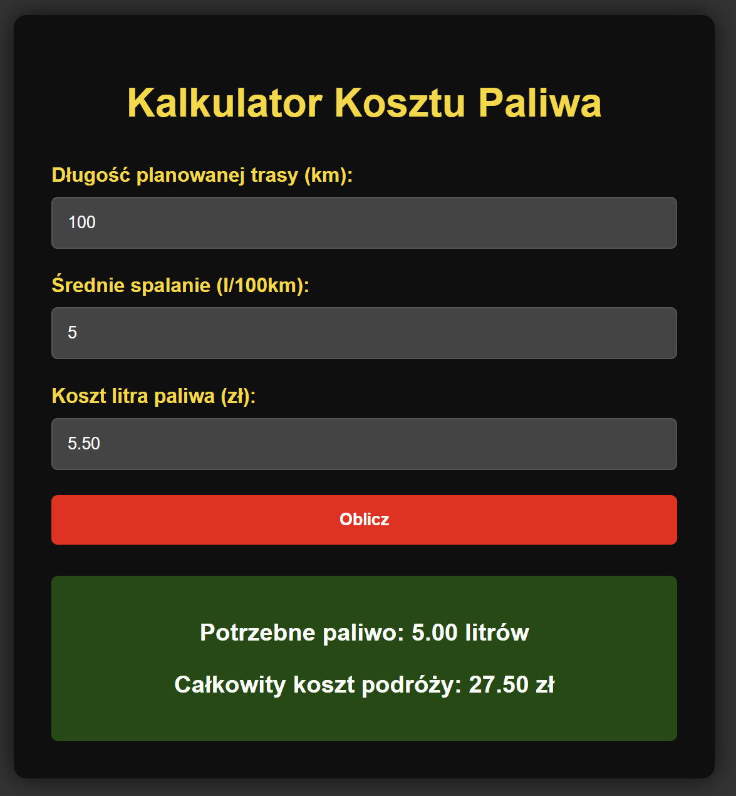

# 🚗 Kalkulator Kosztu Paliwa

Nowoczesna aplikacja webowa do obliczania kosztu paliwa na podstawie długości trasy, średniego spalania oraz ceny paliwa. 🛣️💨



## 🌟 Funkcje

- Obliczanie ilości potrzebnego paliwa na podstawie długości trasy i średniego spalania. ⛽
- Obliczanie całkowitego kosztu podróży na podstawie ceny paliwa. 💰
- Wsparcie dla liczb zmiennoprzecinkowych. 🔢
- Nowoczesny i responsywny interfejs użytkownika. 📱
- Animacje dla lepszego doświadczenia użytkownika. 🎬

## 🛠️ Jak używać

1. Wprowadź długość planowanej trasy w kilometrach.
2. Wprowadź średnie spalanie Twojego pojazdu w litrach na 100 kilometrów.
3. Wprowadź cenę litra paliwa w złotówkach.
4. Kliknij przycisk "Oblicz", aby uzyskać informacje o potrzebnej ilości paliwa oraz całkowitym koszcie podróży.

## 💻 Instalacja

Aby uruchomić projekt lokalnie, wykonaj następujące kroki:

1. Sklonuj repozytorium na swój lokalny komputer:

   ```bash
   git clone https://github.com/twoj-uzytkownik/kalkulator-kosztu-paliwa.git
   ```

2. Przejdź do katalogu projektu:

   ```bash
   cd kalkulator-kosztu-paliwa
   ```

3. Otwórz plik `index.html` w swojej przeglądarce internetowej.

## 📋 Wymagania

- Przeglądarka internetowa obsługująca HTML5, CSS3 i JavaScript.

## 📂 Struktura projektu

- `index.html`: Główna struktura strony. 🏠
- `styles.css`: Stylizacja strony. 🎨
- `script.js`: Logika aplikacji. ⚙️
- `favicon.ico`: Ikona strony wyświetlana na pasku karty przeglądarki. 🖼️

## 👤 Autorzy

- Kacper - k4kacper@gmail.com
